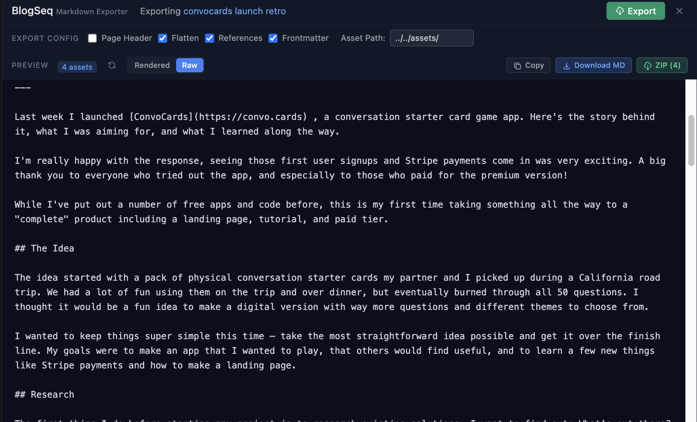
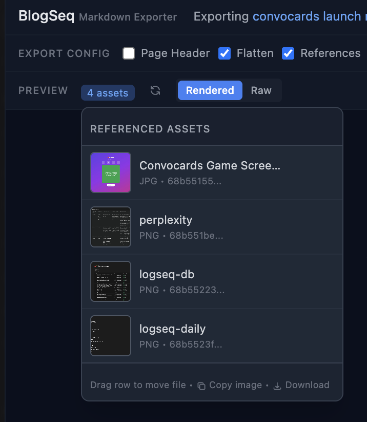
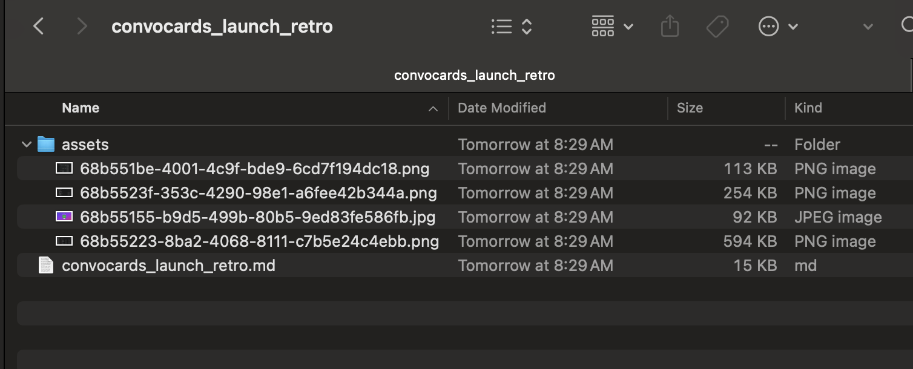

# BlogSeq - Markdown Export with Images for Logseq 🪵

> Transform your Logseq knowledge graph into clean, portable Markdown with referenced images included in the export.

<!--  -->

⚠️ Only works with DB Version

⚠️ Pre Alpha Release - Expect breaking changes and bugs.

## 🎯 Why BlogSeq?

- **🚀 One-Click Export** - Transform any page into clean Markdown instantly
- **📸 Image Management** - All referenced images automatically included in zip exports.
- **⚡ Real-Time Preview** - Markdown preview to see exactly what you'll get before exporting
- **🎨 Clean Output** - No proprietary syntax, just standard Markdown
- **📦 Portable Archives** - ZIP exports with organized asset folders
- **🔧Customizable** - Control asset path and other aspects of the export process

Perfect for:
- 📚 Publishing blog posts from your notes
- 📖 Creating documentation from knowledge bases
- 🤝 Sharing research with colleagues

## ✨ Features

### Core Export Capabilities

#### 📄 Markdown Preview 
- Preview your markdown export in real-time
- See exactly what you'll get before exporting
- Preview images inline with your content


#### 📄 Smart Markdown Export
- Preserves your document structure and formatting
- Converts Logseq blocks to proper Markdown headers (`#` through `######`)
- Handles nested lists, quotes, and code blocks


#### 🖼️ Comprehensive Asset Handling
- Automatically detects all referenced images and files
- Organizes assets in a clean folder structure
- Updates all links to use relative paths
- Supports common media formats

##### 📦 Assets in ZIP




#### 📊 YAML Frontmatter Generation
- Exports page properties as standard YAML frontmatter
- Perfect for static site generators (Jekyll, Hugo, Gatsby)
- Includes tags, dates, and custom properties
- Compatible with Obsidian and other tools


#### 🔗 Intelligent Reference Resolution
- Resolves `((block references))` to actual content
- Converts `[[page links]]` to readable text or links
- Handles complex nested references
- Optional UUID resolution for internal links

### Export Options


| Option | Description | Use Case |
|--------|-------------|----------|
| **Include Page Name** | Adds page title as H1 header | Blog posts, documentation |
| **Flatten Nested Blocks** | Converts nested blocks to paragraphs | Cleaner article format |
| **Preserve Block References** | Resolves `((uuid))` references | Maintain connections |
| **Include Properties** | Generates YAML frontmatter | Static site generators |
| **Remove Logseq Syntax** | Strips proprietary markup | Universal compatibility |
| **Include Tags** | Preserves #hashtags | Categorization |

## 🚀 Getting Started

### Installation

#### Method 1: Logseq Marketplace (Recommended)
1. Open Logseq Settings → Plugins
2. Search for "BlogSeq"
3. Click Install
4. Restart Logseq

#### Method 2: Manual Installation
1. Download the latest release from [GitHub Releases](https://github.com/briansunter/blogseq/releases)
2. Extract the ZIP file
3. In Logseq: Settings → Enable Developer Mode
4. Click "Load unpacked plugin"
5. Select the extracted folder

### Basic Usage

#### Quick Export (Toolbar)

1. Navigate to any page
2. Click the BlogSeq icon in the toolbar
3. Configure your export settings
4. Click "Export" or "Download ZIP"

#### Slash Command

1. Type `/Export page to markdown` on any page
2. Press Enter to open the export dialog

#### Page Menu

1. Right-click any page in the sidebar
2. Select "Export to Markdown"

## 📖 User Guide

### Exporting Your First Page

1. **Open a page** you want to export
2. **Click the BlogSeq icon** in the toolbar
3. **Preview appears automatically** - review your content
4. **Configure settings** using the checkboxes:
   - ✅ Include page name as header
   - ✅ Include properties as frontmatter
   - ✅ Preserve block references
5. **Export options**:
   - 📄 **Copy to Clipboard** - Paste anywhere
   - 💾 **Download Markdown** - Save as .md file
   - 📦 **Download ZIP** - Includes all assets


### Working with Assets

BlogSeq automatically handles all your media:

```markdown
<!-- Original Logseq -->
[[1234-abcd-block-reference-asset]]
[[image]]

<!-- Exported Markdown -->

```

All assets are:
- ✅ Automatically detected
- ✅ Copied with correct names
- ✅ Organized in `/assets/` folder (customizable)
- ✅ Links updated to relative paths

### Advanced Features

#### Batch Export (Coming Soon)
- Export multiple pages at once
- Filter by tags or properties
- Custom folder structure

## ⚙️ Configuration

### Global Settings

Access via Logseq Settings → Plugin Settings → BlogSeq

```json
{
  "defaultIncludePageName": true,
  "defaultFlattenNested": false,
  "defaultPreserveBlockRefs": true,
  "defaultIncludeProperties": true,
  "assetPath": "assets/",
  "autoPreview": true
}
```

## 🛠️ Development

### Prerequisites
- Node.js 18+
- pnpm 6+
- Logseq Desktop

### Setup
```bash
# Clone the repository
git clone https://github.com/briansunter/blogseq.git
cd blogseq

# Install dependencies
pnpm install

# Start development
pnpm dev

# Build for production
pnpm build
```

### Tech Stack
- ⚛️ React 18 + TypeScript
- ⚡ Vite for lightning-fast builds
- 🎨 TailwindCSS for styling
- 📝 react-markdown for preview
- 📦 JSZip for archive creation

### Project Structure
```
blogseq/
├── src/
│   ├── main.tsx           # Plugin entry point
│   ├── App.tsx            # Main UI component
│   ├── markdownExporter.ts # Core export logic
│   └── components/        # UI components
├── dist/                  # Build output
└── package.json          # Project config
```

## 🤝 Contributing

We love contributions! 

## 📜 License

MIT © [Brian Sunter](https://github.com/briansunter)

## 🙏 Acknowledgments

- The amazing [Logseq](https://logseq.com) team for creating an incredible tool
- The Logseq plugin community for inspiration and support
- All contributors and users who make BlogSeq better

## 💬 Support & Community

- 🐛 [Report Issues](https://github.com/briansunter/blogseq/issues)
- 💡 [Request Features](https://github.com/briansunter/blogseq/discussions)
- 🐦 [Follow on Twitter](https://twitter.com/briansunter)


<p align="center">
  Made with ❤️ for the Logseq community
</p>

<p align="center">
  <a href="https://github.com/briansunter/blogseq">⭐ Star us on GitHub</a> •
  <a href="https://twitter.com/intent/tweet?text=Check%20out%20BlogSeq%20-%20Professional%20Markdown%20Export%20for%20Logseq!&url=https://github.com/briansunter/blogseq">Share on Twitter</a>
</p>