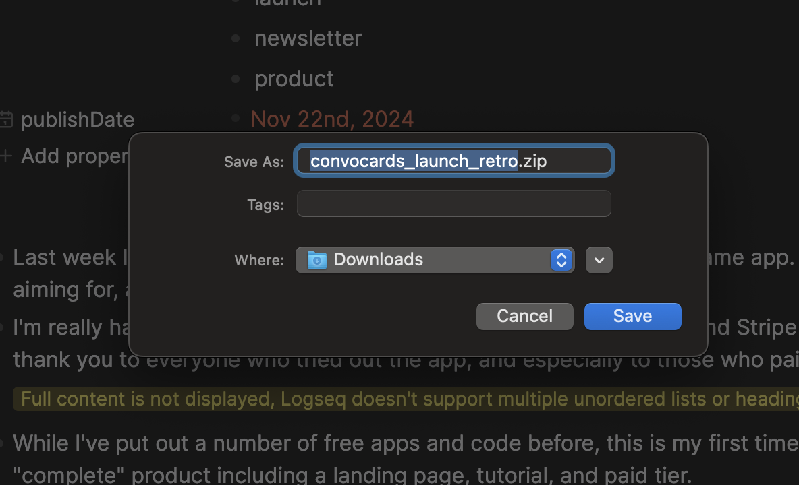
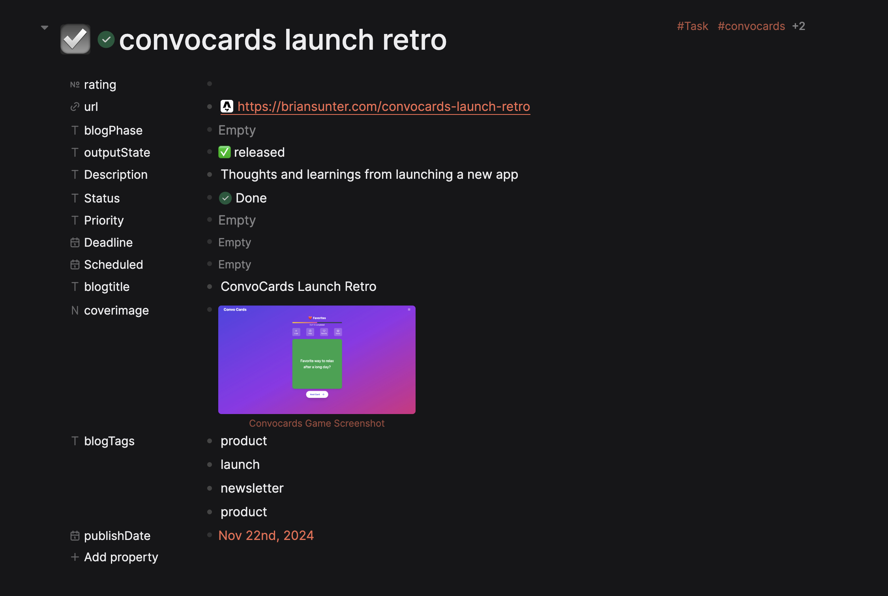
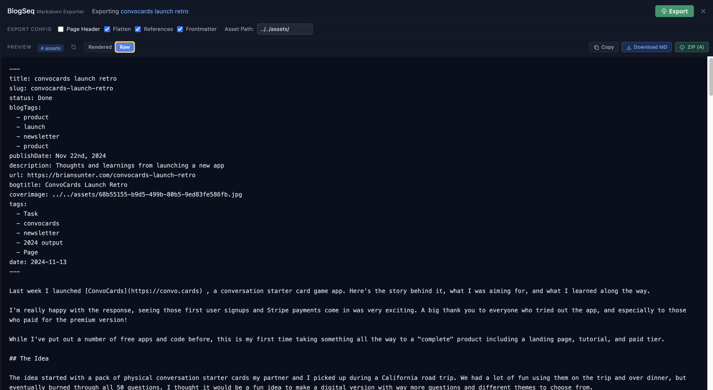
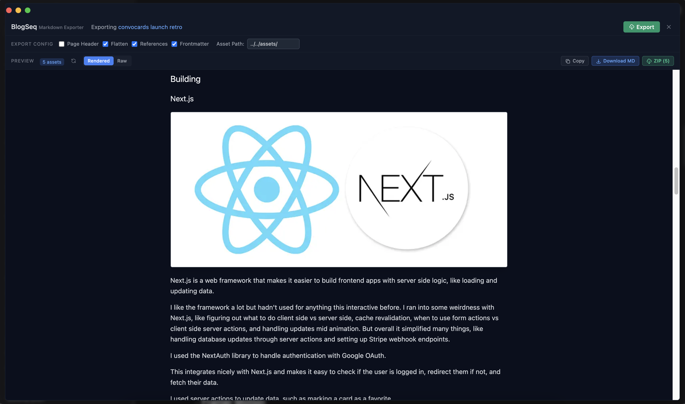
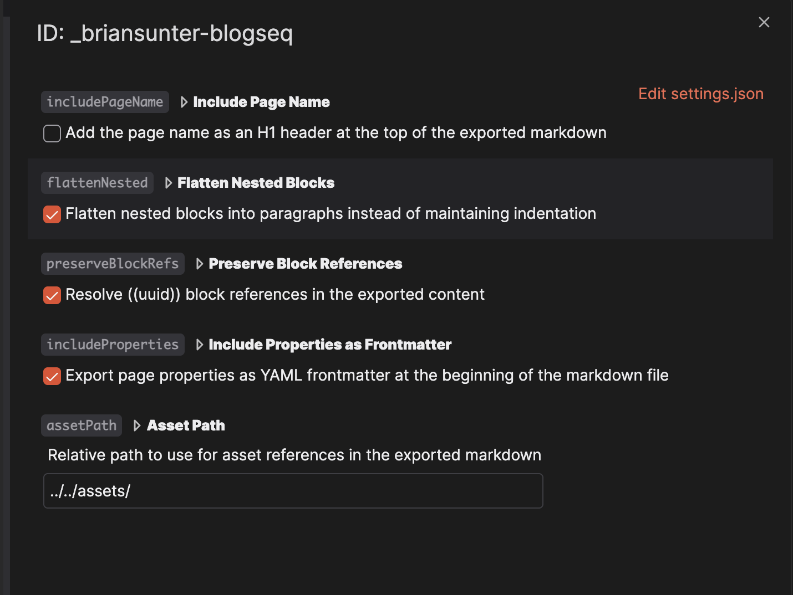

# BlogSeq - Professional Markdown Export with Bundled Assets for Logseq 🪵

[](https://github.com/briansunter/blogseq/actions)
[](https://github.com/briansunter/blogseq/actions)
[](LICENSE)
[](TESTING.md)

> Transform your Logseq pages into clean, portable Markdown with **all referenced images and assets automatically bundled** - ready for any static site generator, blog platform, or documentation tool.

⚠️ **DB Version Only** | Pre-Alpha Release

## 🚀 The Export Flow

1. **Write in Logseq** - Use blocks, references, images, and properties as normal
2. **BlogSeq Resolves Everything** - Automatically finds and bundles all referenced images (even in asset properties), resolves block/page references, and converts to clean Markdown
3. **Export with Assets** - Get a ZIP with your Markdown + all images in an organized `/assets/` folder
4. **Use Anywhere** - Compatible with Jekyll, Hugo, Gatsby, Obsidian, or any Markdown tool


## ✨ Key Features

### 🖼️ **Automatic Asset Bundling**
BlogSeq's killer feature - it finds and bundles **ALL** referenced images automatically:
- Detects images in blocks, properties, and even nested references
- Resolves UUID-based asset references to actual files
- Creates organized `/assets/` folder with all media
- Updates all links to relative paths



### 📊 **YAML Frontmatter for Static Sites**
Converts Logseq properties into standard YAML frontmatter - perfect for Jekyll, Hugo, Gatsby:

**Logseq Properties:**


**↓ Becomes Clean YAML Frontmatter:**


### 🔗 **Complete Reference Resolution**
- Resolves `((block references))` to actual content
- Converts `[[page links]]` to readable text
- Handles nested and complex references
- Even resolves images referenced by UUID in properties

### ⚡ **Real-Time Preview**
See exactly what you'll get before exporting:


### Export Options
Customize your export with simple checkboxes:
- **Page Name as Header** - Add title as H1
- **Flatten Blocks** - Clean paragraph format
- **Include Properties** - YAML frontmatter for static sites
- **Preserve References** - Resolve block/page links
- **Clean Syntax** - Remove Logseq-specific markup



## 🚀 Quick Start

### Installation

**From Marketplace** (Recommended)
1. Settings → Plugins → Search "BlogSeq" → Install

**Manual Installation**
1. Download from [Releases](https://github.com/briansunter/blogseq/releases)
2. Settings → Enable Developer Mode → Load unpacked plugin

### Usage

Three ways to export:
1. **Toolbar** - Click BlogSeq icon
2. **Slash Command** - Type `/Export page to markdown`
3. **Right-Click** - Any page → "Export to Markdown"

## 📖 How It Works

### Export Options
- **📄 Copy to Clipboard** - Quick paste anywhere
- **💾 Download Markdown** - Single .md file  
- **📦 Download ZIP** - Markdown + all assets bundled

### Asset Magic 🪄
BlogSeq automatically converts:
```markdown
[[uuid-reference-to-image]] → 
((block-with-image))       → Content with 
property:: [[asset-uuid]]  → property: assets/document.pdf
```

All images and assets are bundled in the ZIP export - no broken links!

## ⚙️ Configuration

Settings → Plugin Settings → BlogSeq

- `assetPath`: Customize asset folder name (default: `"assets/"`)
- `autoPreview`: Show preview on open (default: `true`)
- Set default export options for all exports

## 🛠️ Development

```bash
git clone https://github.com/briansunter/blogseq.git
cd blogseq
pnpm install
pnpm dev     # Development with HMR
pnpm build   # Production build
```

**Tech Stack:** React 18 • TypeScript • Vite • TailwindCSS • JSZip

## 🧪 Testing

BlogSeq has comprehensive test coverage with 134+ tests across unit, component, and integration tests:

### Run Tests
```bash
pnpm test              # Watch mode
pnpm test:coverage     # Generate coverage report
pnpm test:ui           # Interactive test dashboard
```

### Test Structure
- **Unit Tests (70%)**: Core export logic, hooks, utilities
- **Component Tests (20%)**: React components, UI interactions
- **Integration Tests (10%)**: End-to-end workflows, ZIP generation, asset handling

### Code Quality
- **Type Checking**: `pnpm typecheck` (TypeScript strict mode)
- **Linting**: `npx eslint src` (zero warnings)
- **Coverage**: 80%+ across all metrics
- **Pre-commit Hooks**: Automatic checks on every commit

See [TESTING.md](TESTING.md) for detailed testing documentation, best practices, and troubleshooting.

## 🤝 Contributing

Contributions welcome! [Open an issue](https://github.com/briansunter/blogseq/issues) or submit a PR.

## 📜 License

MIT © [Brian Sunter](https://github.com/briansunter)

## 💬 Links

- [Report Issues](https://github.com/briansunter/blogseq/issues)
- [Request Features](https://github.com/briansunter/blogseq/discussions)
- [Follow @briansunter](https://twitter.com/briansunter)

---

<p align="center">
  <a href="https://github.com/briansunter/blogseq">⭐ Star on GitHub</a> •
  Made with ❤️ for the Logseq community
</p>
